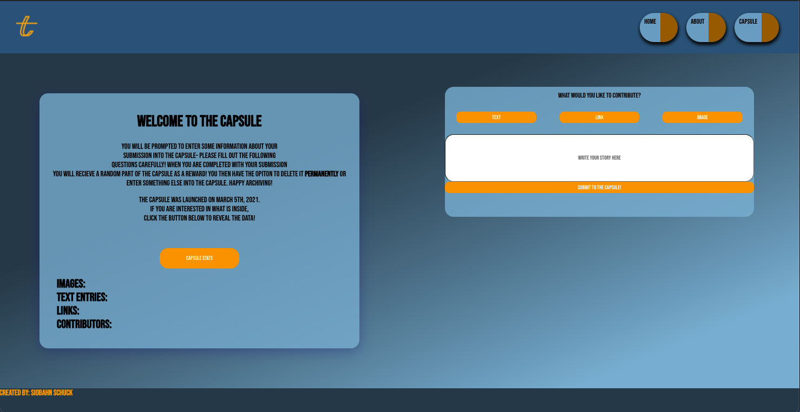

# timeCapped

### Date 3/1/2021

#### By: Siobahn Schuck

[website](https://www.siobahnschuck.com) |
[vimeo](https://www.vimeo.com/siobahnschuck)
| [linkedIn](https://www.linkedin.com/in/siobahnschuck/) |
[gitHub](https://github.com/siobahnschuck)

---

### **_Description_**

ime Capped sends you on an instant internet voyage.

As an active time capsule any visitor to the capsule is welcomed to trade a piece of media for something out of the capsule. You might uncover
something rare, a personal anecdote from another visitor, or a relic of meme history. Fostered from a deep love of the Voager Golden Record and archival practices, timeCapped aims to be a platform for an internet expierement and a way to instantly ignite nostalgia.

Media currently accepted:

- Images location links
- Links to other websites
- Text of a story, your name, anything you want to type

---

### **_Technologies_**

---

### **_Getting Started_**

To view my Trello board click [here](https://trello.com/b/3IIwgRCc/timecapped)

### Installation Instructions

Otherwise to view and participate in the time capsule click [this link]() to visit my website.

---

## **_Application Images_**

### Final Design

### Original Concepts

---

### **_Future Updates_**

- [ ] download content
- [x] link posts to social media sites.
- [ ] mobile friendly

---

### **_Credits_**

Inspiration:

- [Voager Golden Record](https://voyager.jpl.nasa.gov/golden-record/)
- [Internet Archive](https://archive.org/index.php)
- [This NYT instagram post](https://www.nytimes.com/interactive/2020/09/30/smarter-living/pandemic-time-capsule.html)

Technical:

- [Tutorial on React-Share](https://www.youtube.com/watch?v=2BnTYEafRQc)
- [Trash Icon](https://www.icons8.com)
- [Fonts](https://fonts.google.com/specimen/Lobster?preview.text_type=custom#standard-styles)
- [Image hosting](https://imgbb.com/)
