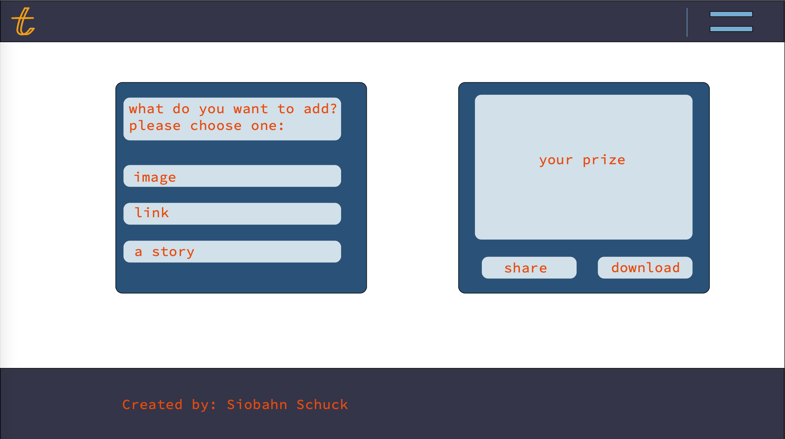
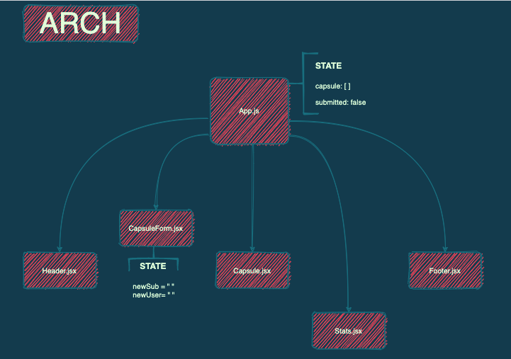

# timeCapped

### Date 3/1/2021

#### By: Siobahn Schuck

[website](https://www.siobahnschuck.com) |
[vimeo](https://www.vimeo.com/siobahnschuck)
 | [linkedIn](https://www.linkedin.com/in/siobahnschuck/) |
[gitHub](https://github.com/siobahnschuck)

***
### ***Description***

ime Capped sends you on an instant internet voyage. 

As an active time capsule any visitor to the capsule is welcomed to trade a piece of media for something out of the capsule. You might uncover 
something rare, a personal anecdote from another visitor, or a relic of meme history. Fostered from a deep love of the Voager Golden Record and archival practices. timeCapped aims to be a platform of an internet expierement and a way to instantly ignite nostalgia.

Media currently accepted: 
* Images 
* Links to other websites 
* Text of a story, your name, anything you want to type
* Audio files 

***
### ***Technologies***
* HTML 
* CSS 
* JavaScript
  * REACT 
  * MongoDB
  * Express.js
  * Mongoose

***
### ***Getting Started***

To view my Trello board click [here](https://trello.com/b/3IIwgRCc/timecapped)

### Installation Instructions

Otherwise to view and participate in the time capsule click [this link]() to visit my website.

***
### ***User Stories***

"I never thought media compensation would bring me so much joy! Who needs money when I can trade content all day long! And it's free!"
-Anonymous, Brooklyn NY, 2021

***
## ***Application Images***

### Original Concepts

### Architectural Drawings

### Code Snippets

*** 
### ***Future Updates***
- [ ] link posts to social media sites. 

*** 
### ***Credits***

Inspiration: 
* [Voager Golden Record](https://voyager.jpl.nasa.gov/golden-record/)
* [Internet Archive](https://archive.org/index.php)
* [This NYT instagram post](https://www.nytimes.com/interactive/2020/09/30/smarter-living/pandemic-time-capsule.html)

